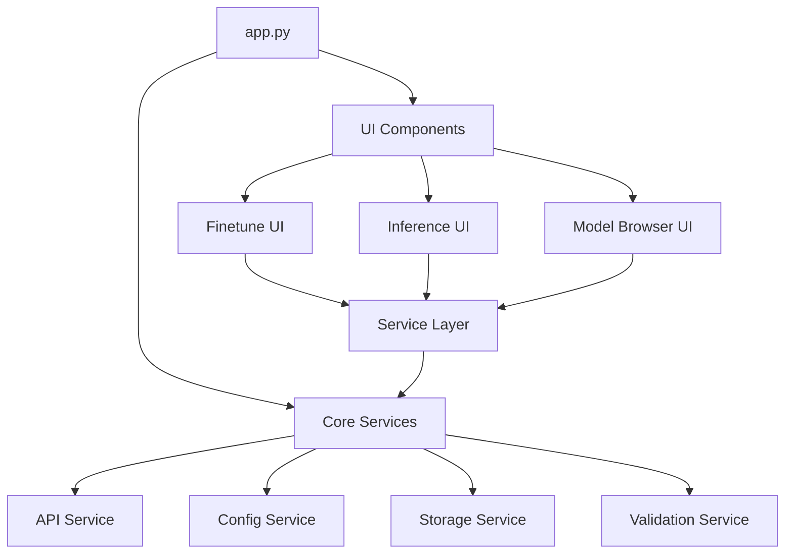

# FLUX-Pro-Finetuning-UI Refactoring Plan

## Overview

This document outlines a comprehensive plan to refactor the FLUX-Pro-Finetuning-UI codebase to improve maintainability, scalability, and readability while preserving all existing functionality. The refactoring will address identified issues in the current architecture and implement a service-oriented approach with clear separation of concerns.

## Current Architecture Issues

The current codebase suffers from several maintenance challenges:

1. **Redundant API Communication**: Multiple classes implement similar HTTP requests to the same endpoints, creating duplication and inconsistency.
2. **Inconsistent Error Handling**: Error management varies across components, making debugging difficult and error responses unpredictable.
3. **Tight Coupling**: UI components directly depend on implementation details of other components, making changes difficult.
4. **Scattered State Management**: No centralized approach to state handling leads to inconsistent state updates and potential data inconsistencies.
5. **Mixed Concerns**: Business logic is intertwined with presentation code, making both harder to maintain independently.
6. **Duplicated Validation**: Similar validation logic repeats across files, leading to inconsistent validation and redundancy.
7. **Complex File Operations**: Direct file system access is scattered throughout the code, with inconsistent error handling and security practices.

## Proposed Architecture

We will refactor to a service-oriented architecture with clear separation of concerns:



## Detailed Implementation Plan

### 1. Core Services Layer

The foundation of the new architecture will be a set of core services that handle fundamental operations.

#### 1.1. API Service (`services/api_service.py`)

A unified API client to handle all API communications with consistent error handling.

```python
class APIService:
    def __init__(self, config_service):
        self.config = config_service
        self.api_key = config_service.get_api_key()
        self.host = config_service.get_api_host()
        
    def request(self, method, endpoint, params=None, json_data=None):
        """Base method for all API requests with consistent error handling"""
        # Implementation...
        
    def get_model_details(self, finetune_id):
        """Get details for a specific model"""
        # Implementation using self.request()
        
    def list_finetunes(self):
        """List all finetunes"""
        # Implementation using self.request()
        
    def start_finetune(self, params):
        """Start a finetuning job"""
        # Implementation using self.request()
        
    def generate_image(self, endpoint, params):
        """Generate an image using specified endpoint"""
        # Implementation using self.request()
```

#### 1.2. Configuration Service (`services/config_service.py`)

Centralized configuration management with environment variable support and validation.

```python
class ConfigService:
    def __init__(self, config_path="config/config.json"):
        self.config_path = config_path
        self.config = self._load_config()
        
    def _load_config(self):
        """Load and validate configuration"""
        # Implementation...
        
    def get_api_key(self):
        """Get API key with environment variable fallback"""
        # Implementation...
        
    def get_api_host(self):
        """Get API host with default"""
        # Implementation...
        
    def get_storage_path(self, key):
        """Get a storage path from config"""
        # Implementation...
```

#### 1.3. Storage Service (`services/storage_service.py`)

Centralized file operations with proper error handling and security.

```python
class StorageService:
    def __init__(self, config_service):
        self.config = config_service
        self.setup_directories()
        
    def setup_directories(self):
        """Ensure all required directories exist"""
        # Implementation...
        
    def save_model_metadata(self, models):
        """Save model metadata to storage"""
        # Implementation...
        
    def load_model_metadata(self):
        """Load model metadata from storage"""
        # Implementation...
        
    def save_generated_image(self, image_data, format="jpeg"):
        """Save a generated image to storage"""
        # Implementation...
```

#### 1.4. Validation Service (`services/validation_service.py`)

Centralized validation logic for all input data.

```python
class ValidationService:
    def validate_model_metadata(self, data):
        """Validate model metadata format"""
        # Implementation...
        
    def validate_prompt(self, prompt):
        """Validate text prompt format and content"""
        # Implementation...
        
    def validate_numeric_param(self, value, min_val, max_val, allow_none=True):
        """Validate numeric parameter within range"""
        # Implementation...
        
    def sanitize_display_text(self, text):
        """Sanitize text for display in UI"""
        # Implementation...
```

### 2. Service Layer

Building on the core services, we'll create specialized business services for each functional area.

#### 2.1. Model Service (`services/model_service.py`)

Manages model data and operations.

```python
class ModelService:
    def __init__(self, api_service, storage_service, validation_service):
        self.api = api_service
        self.storage = storage_service
        self.validation = validation_service
        self.models = self._load_models()
        
    def _load_models(self):
        """Load models from storage"""
        # Implementation...
        
    def list_models(self):
        """List all models"""
        # Implementation...
        
    def get_model(self, finetune_id):
        """Get a specific model by ID"""
        # Implementation...
        
    def refresh_models(self):
        """Refresh models from API"""
        # Implementation...
        
    def add_model(self, metadata):
        """Add or update a model"""
        # Implementation...
```

#### 2.2. Finetuning Service (`services/finetuning_service.py`)

Handles finetuning operations and monitoring.

```python
class FinetuningService:
    def __init__(self, api_service, model_service, storage_service):
        self.api = api_service
        self.model_service = model_service
        self.storage = storage_service
        
    def start_finetune(self, file_path, params):
        """Start a finetuning job"""
        # Implementation...
        
    def check_status(self, finetune_id):
        """Check status of a finetuning job"""
        # Implementation...
        
    def process_upload(self, file):
        """Process uploaded file and return path"""
        # Implementation...
```

#### 2.3. Inference Service (`services/inference_service.py`)

Manages image generation and results handling.

```python
class InferenceService:
    def __init__(self, api_service, model_service, storage_service, validation_service):
        self.api = api_service
        self.model_service = model_service
        self.storage = storage_service
        self.validation = validation_service
        
    def generate_image(self, endpoint, params):
        """Generate an image using specified endpoint and parameters"""
        # Implementation...
        
    def get_generation_status(self, inference_id):
        """Check status of a generation task"""
        # Implementation...
        
    def save_image_from_url(self, image_url, output_format):
        """Get image from URL or base64 data and save it"""
        # Implementation...
```

### 3. UI Components

With the service layer in place, UI components can focus solely on presentation.

#### 3.1. Base UI Component (`ui/base.py`)

Common UI functionality and styling.

```python
class BaseUI:
    def __init__(self):
        self.theme = self._setup_theme()
        
    def _setup_theme(self):
        """Set up consistent theme and styling"""
        # Implementation...
        
    def create_header(self, title, description=""):
        """Create standardized header component"""
        # Implementation...
```

#### 3.2. Refactored Finetune UI (`ui/finetune_ui.py`)

UI for finetuning models.

```python
class FineTuneUI(BaseUI):
    def __init__(self, finetuning_service, model_service):
        super().__init__()
        self.finetuning_service = finetuning_service
        self.model_service = model_service
        
    def create_ui(self):
        """Create the finetune interface UI components"""
        # Implementation using Gradio components
        # Focus on UI layout only, delegate business logic to services
```

#### 3.3. Refactored Inference UI (`ui/inference_ui.py`)

UI for generating images with models.

```python
class ImageGenerationUI(BaseUI):
    def __init__(self, inference_service, model_service):
        super().__init__()
        self.inference_service = inference_service
        self.model_service = model_service
        
    def create_ui(self):
        """Create the image generation interface UI components"""
        # Implementation using Gradio components
        # Focus on UI layout only, delegate business logic to services
```

#### 3.4. Refactored Model Browser UI (`ui/model_browser_ui.py`)

UI for browsing and managing models.

```python
class ModelBrowserUI(BaseUI):
    def __init__(self, model_service):
        super().__init__()
        self.model_service = model_service
        
    def create_ui(self):
        """Create the model browser interface UI components"""
        # Implementation using Gradio components
        # Focus on UI layout only, delegate business logic to services
```

### 4. Application Entry Point

#### 4.1. Dependency Injection (`container.py`)

Wires services and UI components together.

```python
class ServiceContainer:
    def __init__(self):
        # Initialize services
        self.config_service = ConfigService()
        self.api_service = APIService(self.config_service)
        self.storage_service = StorageService(self.config_service)
        self.validation_service = ValidationService()
        
        # Initialize business services
        self.model_service = ModelService(
            self.api_service, 
            self.storage_service, 
            self.validation_service
        )
        self.finetuning_service = FinetuningService(
            self.api_service, 
            self.model_service, 
            self.storage_service
        )
        self.inference_service = InferenceService(
            self.api_service, 
            self.model_service, 
            self.storage_service, 
            self.validation_service
        )
        
        # Initialize UI components
        self.finetune_ui = FineTuneUI(self.finetuning_service, self.model_service)
        self.inference_ui = ImageGenerationUI(self.inference_service, self.model_service)
        self.model_browser_ui = ModelBrowserUI(self.model_service)
```

#### 4.2. Main Application (`app.py`)

Main entry point for the application.

```python
def create_app():
    # Initialize service container
    container = ServiceContainer()
    
    # Create the combined interface
    with gr.Blocks(title="FLUX [pro] Finetuning UI") as demo:
        # Header and UI layout...
        
        with gr.Tabs():
            with gr.Tab("Finetune Model"):
                # Finetune UI
                container.finetune_ui.create_ui()
                
            with gr.Tab("Model Browser"):
                # Model Browser UI
                container.model_browser_ui.create_ui()
                
            with gr.Tab("Generate with Model"):
                # Inference UI
                container.inference_ui.create_ui()
                
    return demo

demo = create_app()

if __name__ == "__main__":
    demo.launch(share=False)
```

## Implementation Phases

To implement this refactoring effectively, we'll proceed in four phases:

### Phase 1: Core Infrastructure (1-2 weeks)

1. Create directory structure for new architecture
2. Implement ConfigService
3. Implement StorageService
4. Implement ValidationService
5. Implement APIService
6. Write tests for core services

### Phase 2: Business Services (1-2 weeks)

1. Implement ModelService
2. Implement FinetuningService
3. Implement InferenceService
4. Create ServiceContainer for dependency injection
5. Write tests for business services

### Phase 3: UI Refactoring (2-3 weeks)

1. Create BaseUI with common functionality
2. Refactor FineTuneUI to use services
3. Refactor ImageGenerationUI to use services
4. Refactor ModelBrowserUI to use services
5. Update main app.py to use the new components

### Phase 4: Testing and Documentation (1 week)

1. Comprehensive integration testing
2. Update documentation
3. Add inline code comments and docstrings
4. Create user guide for new architecture

## Benefits of This Approach

The refactoring provides several key benefits:

1. **Improved Maintainability**: Clear separation of concerns makes code easier to understand and modify
2. **Better Testability**: Isolated services are easier to test independently
3. **Enhanced Reliability**: Consistent error handling and validation across the application
4. **Future Scalability**: New features can be added by extending services, not modifying existing code
5. **Reduced Duplication**: Common functionality is centralized in services
6. **Simplified UI Code**: UI components focus only on presentation, making them cleaner and easier to modify

## Migration Strategy

To minimize disruption, we'll implement this refactoring incrementally:

1. Create new service structure alongside existing code
2. Gradually migrate functionality to new services
3. Update UI components one at a time to use new services
4. Run parallel testing to ensure functionality remains identical
5. Once fully migrated, remove deprecated code

This approach allows for continuous testing throughout the migration, reducing the risk of regressions.

## Conclusion

This refactoring plan provides a structured approach to simplify the FLUX-Pro-Finetuning-UI codebase while preserving functionality. By focusing on separation of concerns, dependency injection, and service-oriented architecture, we can create a more maintainable and scalable application that will be easier to extend with new features in the future.